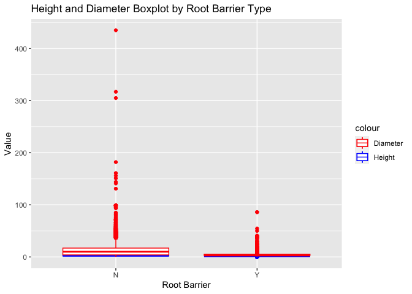
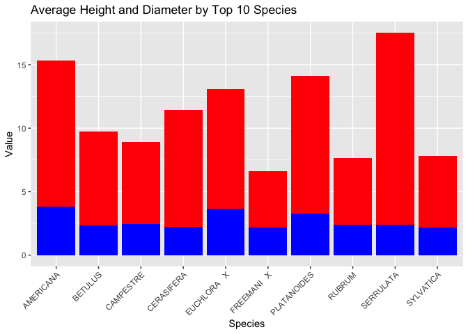
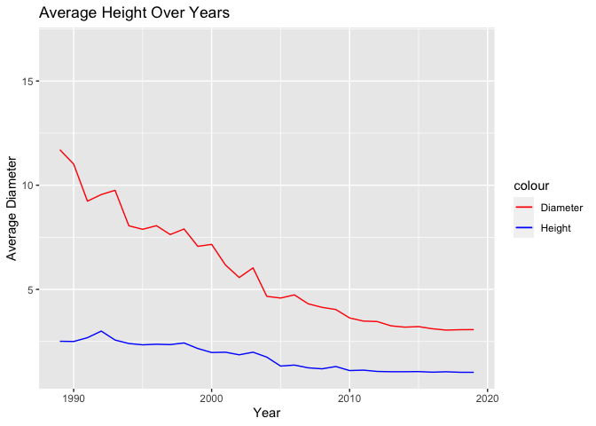
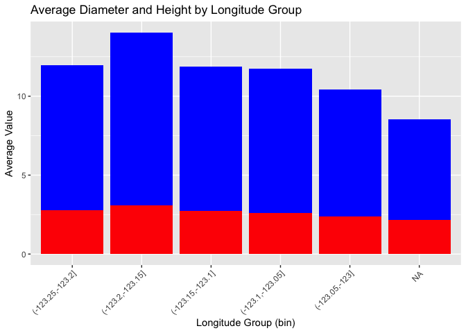

*To complete this milestone, you can either edit [this `.rmd`
file](https://raw.githubusercontent.com/UBC-STAT/stat545.stat.ubc.ca/master/content/mini-project/mini-project-2.Rmd)
directly. Fill in the sections that are commented out with
`<!--- start your work here--->`. When you are done, make sure to knit
to an `.md` file by changing the output in the YAML header to
`github_document`, before submitting a tagged release on canvas.*

# Welcome to the rest of your mini data analysis project!

In Milestone 1, you explored your data. and came up with research
questions. This time, we will finish up our mini data analysis and
obtain results for your data by:

-   Making summary tables and graphs
-   Manipulating special data types in R: factors and/or dates and
    times.
-   Fitting a model object to your data, and extract a result.
-   Reading and writing data as separate files.

We will also explore more in depth the concept of *tidy data.*

**NOTE**: The main purpose of the mini data analysis is to integrate
what you learn in class in an analysis. Although each milestone provides
a framework for you to conduct your analysis, it’s possible that you
might find the instructions too rigid for your data set. If this is the
case, you may deviate from the instructions – just make sure you’re
demonstrating a wide range of tools and techniques taught in this class.

# Instructions

**To complete this milestone**, edit [this very `.Rmd`
file](https://raw.githubusercontent.com/UBC-STAT/stat545.stat.ubc.ca/master/content/mini-project/mini-project-2.Rmd)
directly. Fill in the sections that are tagged with
`<!--- start your work here--->`.

**To submit this milestone**, make sure to knit this `.Rmd` file to an
`.md` file by changing the YAML output settings from
`output: html_document` to `output: github_document`. Commit and push
all of your work to your mini-analysis GitHub repository, and tag a
release on GitHub. Then, submit a link to your tagged release on canvas.

**Points**: This milestone is worth 50 points: 45 for your analysis, and
5 for overall reproducibility, cleanliness, and coherence of the Github
submission.

**Research Questions**: In Milestone 1, you chose two research questions
to focus on. Wherever realistic, your work in this milestone should
relate to these research questions whenever we ask for justification
behind your work. In the case that some tasks in this milestone don’t
align well with one of your research questions, feel free to discuss
your results in the context of a different research question.

# Learning Objectives

By the end of this milestone, you should:

-   Understand what *tidy* data is, and how to create it using `tidyr`.
-   Generate a reproducible and clear report using R Markdown.
-   Manipulating special data types in R: factors and/or dates and
    times.
-   Fitting a model object to your data, and extract a result.
-   Reading and writing data as separate files.

# Setup

Begin by loading your data and the tidyverse package below:

    library(datateachr) # <- might contain the data you picked!
    library(tidyverse)

# Task 1: Process and summarize your data

From milestone 1, you should have an idea of the basic structure of your
dataset (e.g. number of rows and columns, class types, etc.). Here, we
will start investigating your data more in-depth using various data
manipulation functions.

### 1.1 (1 point)

First, write out the 4 research questions you defined in milestone 1
were. This will guide your work through milestone 2:

<!-------------------------- Start your work below ---------------------------->

1.  Will the usage of root barrier affect the diameter and height of the
    tree?

2.  What is the average diameter and height of each species? (Because
    the species of the trees are too many, only count top 10 species)

3.  What is the relationship between tree age and height?

4.  What is the height and diameter distribution according to the
    longitude?
    <!----------------------------------------------------------------------------->

Here, we will investigate your data using various data manipulation and
graphing functions.

    glimpse(vancouver_trees)

    ## Rows: 146,611
    ## Columns: 20
    ## $ tree_id            <dbl> 149556, 149563, 149579, 149590, 149604, 149616, 149…
    ## $ civic_number       <dbl> 494, 450, 4994, 858, 5032, 585, 4909, 4925, 4969, 7…
    ## $ std_street         <chr> "W 58TH AV", "W 58TH AV", "WINDSOR ST", "E 39TH AV"…
    ## $ genus_name         <chr> "ULMUS", "ZELKOVA", "STYRAX", "FRAXINUS", "ACER", "…
    ## $ species_name       <chr> "AMERICANA", "SERRATA", "JAPONICA", "AMERICANA", "C…
    ## $ cultivar_name      <chr> "BRANDON", NA, NA, "AUTUMN APPLAUSE", NA, "CHANTICL…
    ## $ common_name        <chr> "BRANDON ELM", "JAPANESE ZELKOVA", "JAPANESE SNOWBE…
    ## $ assigned           <chr> "N", "N", "N", "Y", "N", "N", "N", "N", "N", "N", "…
    ## $ root_barrier       <chr> "N", "N", "N", "N", "N", "N", "N", "N", "N", "N", "…
    ## $ plant_area         <chr> "N", "N", "4", "4", "4", "B", "6", "6", "3", "3", "…
    ## $ on_street_block    <dbl> 400, 400, 4900, 800, 5000, 500, 4900, 4900, 4900, 7…
    ## $ on_street          <chr> "W 58TH AV", "W 58TH AV", "WINDSOR ST", "E 39TH AV"…
    ## $ neighbourhood_name <chr> "MARPOLE", "MARPOLE", "KENSINGTON-CEDAR COTTAGE", "…
    ## $ street_side_name   <chr> "EVEN", "EVEN", "EVEN", "EVEN", "EVEN", "ODD", "ODD…
    ## $ height_range_id    <dbl> 2, 4, 3, 4, 2, 2, 3, 3, 2, 2, 2, 5, 3, 2, 2, 2, 2, …
    ## $ diameter           <dbl> 10.00, 10.00, 4.00, 18.00, 9.00, 5.00, 15.00, 14.00…
    ## $ curb               <chr> "N", "N", "Y", "Y", "Y", "Y", "Y", "Y", "Y", "Y", "…
    ## $ date_planted       <date> 1999-01-13, 1996-05-31, 1993-11-22, 1996-04-29, 19…
    ## $ longitude          <dbl> -123.1161, -123.1147, -123.0846, -123.0870, -123.08…
    ## $ latitude           <dbl> 49.21776, 49.21776, 49.23938, 49.23469, 49.23894, 4…

### 1.2 (8 points)

Now, for each of your four research questions, choose one task from
options 1-4 (summarizing), and one other task from 4-8 (graphing). You
should have 2 tasks done for each research question (8 total). Make sure
it makes sense to do them! (e.g. don’t use a numerical variables for a
task that needs a categorical variable.). Comment on why each task helps
(or doesn’t!) answer the corresponding research question.

Ensure that the output of each operation is printed!

Also make sure that you’re using dplyr and ggplot2 rather than base R.
Outside of this project, you may find that you prefer using base R
functions for certain tasks, and that’s just fine! But part of this
project is for you to practice the tools we learned in class, which is
dplyr and ggplot2.

**Summarizing:**

1.  Compute the *range*, *mean*, and *two other summary statistics* of
    **one numerical variable** across the groups of **one categorical
    variable** from your data.
2.  Compute the number of observations for at least one of your
    categorical variables. Do not use the function `table()`!
3.  Create a categorical variable with 3 or more groups from an existing
    numerical variable. You can use this new variable in the other
    tasks! *An example: age in years into “child, teen, adult, senior”.*
4.  Compute the proportion and counts in each category of one
    categorical variable across the groups of another categorical
    variable from your data. Do not use the function `table()`!

**Graphing:**

1.  Create a graph of your choosing, make one of the axes logarithmic,
    and format the axes labels so that they are “pretty” or easier to
    read.
2.  Make a graph where it makes sense to customize the alpha
    transparency.

Using variables and/or tables you made in one of the “Summarizing”
tasks:

1.  Create a graph that has at least two geom layers.
2.  Create 3 histograms, with each histogram having different sized
    bins. Pick the “best” one and explain why it is the best.

Make sure it’s clear what research question you are doing each operation
for!

<!------------------------- Start your work below ----------------------------->

1.  Will the usage of root barrier affect the diameter and height of the
    tree?

<!-- -->

    result <- vancouver_trees %>%
      group_by(root_barrier) %>%
      summarize(
        avg_height = mean(height_range_id),
        avg_diameter = mean(diameter),
        med_height = median(height_range_id),
        med_diameter = median(diameter),
        min_height = min(height_range_id),
        max_height = max(height_range_id),
        min_diameter = min(diameter),
        max_diameter = max(diameter),
        var_height = var(height_range_id),
        var_diameter = var(diameter)
      )
    result

    ## # A tibble: 2 × 11
    ##   root_barrier avg_height avg_diameter med_height med_diameter min_height
    ##   <chr>             <dbl>        <dbl>      <dbl>        <dbl>      <dbl>
    ## 1 N                  2.72        12.0           2           10          0
    ## 2 Y                  1.30         4.40          1            3          0
    ## # ℹ 5 more variables: max_height <dbl>, min_diameter <dbl>, max_diameter <dbl>,
    ## #   var_height <dbl>, var_diameter <dbl>

With this summary information, we can know the distribution of the
height and diameter according to root barrier.

    boxplot <- ggplot(vancouver_trees, aes(x = root_barrier)) +
      geom_boxplot(aes(y = height_range_id, color = "Height")) +
      geom_boxplot(aes(y = diameter, color = "Diameter")) +
      labs(title = "Height and Diameter Boxplot by Root Barrier Type", x = "Root Barrier", y = "Value") +
      scale_color_manual(values = c("Height" = "blue", "Diameter" = "red"))
    boxplot

With this box graph, we can know the distribution of the height and
diameter according to root barrier.

1.  What is the average diameter and height of each species? (Because
    the species of the trees are too many, only count top 10 species)

<!-- -->

    species_count <- vancouver_trees %>%
      group_by(species_name) %>%
      summarize(count = n()) %>%
      arrange(desc(count))

    top_10_species <- head(species_count, 10)

    top_10_data <- vancouver_trees %>%
      filter(species_name %in% top_10_species$species_name)

    result <- top_10_data %>%
      group_by(species_name) %>%
      summarize(
        avg_height = mean(height_range_id),
        avg_diameter = mean(diameter)
      )

    result

    ## # A tibble: 10 × 3
    ##    species_name avg_height avg_diameter
    ##    <chr>             <dbl>        <dbl>
    ##  1 AMERICANA          3.84        15.3 
    ##  2 BETULUS            2.35         9.72
    ##  3 CAMPESTRE          2.42         8.89
    ##  4 CERASIFERA         2.21        11.4 
    ##  5 EUCHLORA   X       3.66        13.1 
    ##  6 FREEMANI   X       2.17         6.63
    ##  7 PLATANOIDES        3.29        14.1 
    ##  8 RUBRUM             2.38         7.68
    ##  9 SERRULATA          2.38        17.5 
    ## 10 SYLVATICA          2.16         7.80

With this summary, we can know the average diameter and height of each
species.

    bar_plot <- ggplot(result, aes(x = species_name)) +
      geom_bar(aes(y = avg_diameter), stat = "identity", fill = "red") +
      geom_bar(aes(y = avg_height), stat = "identity", fill = "blue") +
      labs(title = "Average Height and Diameter by Top 10 Species", x = "Species", y = "Value") +
      theme(axis.text.x = element_text(angle = 45, hjust = 1))

    bar_plot

With this plot, we can know the average diameter and height of each
species and compare them directly.

1.  What is the relationship between tree age and height?

<!-- -->

    age_data <- vancouver_trees %>%
      mutate(year_planted = as.numeric(format(as.Date(date_planted), "%Y")))

    result <- age_data %>%
      group_by(year_planted) %>%
      summarize(avg_diameter = mean(diameter),
                avg_height = mean(height_range_id)) 

    result

    ## # A tibble: 32 × 3
    ##    year_planted avg_diameter avg_height
    ##           <dbl>        <dbl>      <dbl>
    ##  1         1989        11.7        2.51
    ##  2         1990        11.0        2.50
    ##  3         1991         9.23       2.68
    ##  4         1992         9.55       3.00
    ##  5         1993         9.75       2.57
    ##  6         1994         8.05       2.40
    ##  7         1995         7.88       2.34
    ##  8         1996         8.06       2.37
    ##  9         1997         7.63       2.35
    ## 10         1998         7.90       2.43
    ## # ℹ 22 more rows

First I group the date\_planted data with the year, and get the average
diameter and avg\_height.

    line_plot <- ggplot(result, aes(x = year_planted)) +
      geom_line(aes(y = avg_diameter, color = "Diameter")) +
      geom_line(aes(y = avg_height, color = "Height")) +
      labs(title = "Average Height Over Years", x = "Year", y = "Average Diameter") +
      scale_color_manual(values = c("Height" = "blue", "Diameter" = "red"))

    line_plot

    ## Warning: Removed 1 row containing missing values (`geom_line()`).
    ## Removed 1 row containing missing values (`geom_line()`).

With the graph, we can get the height and diameter distribution
according to the year.

1.  What is the height and diameter distribution according to the
    longitude?

<!-- -->

    result <- vancouver_trees %>%
      group_by(bin = cut(longitude, breaks = seq(-123.25, -123, by = 0.05))) %>%
      summarize(
        avg_diameter = mean(diameter),
        avg_height = mean(height_range_id)
      )

    result

    ## # A tibble: 6 × 3
    ##   bin              avg_diameter avg_height
    ##   <fct>                   <dbl>      <dbl>
    ## 1 (-123.25,-123.2]        12.0        2.79
    ## 2 (-123.2,-123.15]        14.0        3.10
    ## 3 (-123.15,-123.1]        11.9        2.73
    ## 4 (-123.1,-123.05]        11.7        2.59
    ## 5 (-123.05,-123]          10.4        2.39
    ## 6 <NA>                     8.52       2.18

First I put the numeric value of longitude into bins with size 0.05,
then calculate the average diameter and height of them.

    line_plot <- ggplot(result, aes(x = bin)) +
      geom_bar(aes(y = avg_diameter), fill = "blue", stat = "identity", position = "dodge") +
      geom_bar(aes(y = avg_height), fill = "red", stat = "identity", position = "dodge") +
      labs(title = "Average Diameter and Height by Longitude Group", x = "Longitude Group (bin)", y = "Average Value") +
      scale_color_manual(values = c("Diameter" = "blue", "Height" = "red")) +
      theme(axis.text.x = element_text(angle = 45, hjust = 1))

    line_plot

With the diagram, I can found out the distribution of the height and
diameter according to longitude.

<!----------------------------------------------------------------------------->

### 1.3 (2 points)

Based on the operations that you’ve completed, how much closer are you
to answering your research questions? Think about what aspects of your
research questions remain unclear. Can your research questions be
refined, now that you’ve investigated your data a bit more? Which
research questions are yielding interesting results?

<!------------------------- Write your answer here ---------------------------->

All questions have been solved! All research questions are clear. The
first question has interesting results.
<!----------------------------------------------------------------------------->

# Task 2: Tidy your data

In this task, we will do several exercises to reshape our data. The goal
here is to understand how to do this reshaping with the `tidyr` package.

A reminder of the definition of *tidy* data:

-   Each row is an **observation**
-   Each column is a **variable**
-   Each cell is a **value**

### 2.1 (2 points)

Based on the definition above, can you identify if your data is tidy or
untidy? Go through all your columns, or if you have &gt;8 variables,
just pick 8, and explain whether the data is untidy or tidy.

<!--------------------------- Start your work below --------------------------->

    na_counts <- colSums(is.na(vancouver_trees))
    na_counts

    ##            tree_id       civic_number         std_street         genus_name 
    ##                  0                  0                  0                  0 
    ##       species_name      cultivar_name        common_name           assigned 
    ##                  0              67559                  0                  0 
    ##       root_barrier         plant_area    on_street_block          on_street 
    ##                  0               1486                  0                  0 
    ## neighbourhood_name   street_side_name    height_range_id           diameter 
    ##                  0                  0                  0                  0 
    ##               curb       date_planted          longitude           latitude 
    ##                  0              76548              22771              22771

The data is untidy because there are N/A values in some cells.
<!----------------------------------------------------------------------------->

### 2.2 (4 points)

Now, if your data is tidy, untidy it! Then, tidy it back to it’s
original state.

If your data is untidy, then tidy it! Then, untidy it back to it’s
original state.

Be sure to explain your reasoning for this task. Show us the “before”
and “after”.

<!--------------------------- Start your work below --------------------------->

    na_counts_before <- colSums(is.na(vancouver_trees))
    na_counts_before

    ##            tree_id       civic_number         std_street         genus_name 
    ##                  0                  0                  0                  0 
    ##       species_name      cultivar_name        common_name           assigned 
    ##                  0              67559                  0                  0 
    ##       root_barrier         plant_area    on_street_block          on_street 
    ##                  0               1486                  0                  0 
    ## neighbourhood_name   street_side_name    height_range_id           diameter 
    ##                  0                  0                  0                  0 
    ##               curb       date_planted          longitude           latitude 
    ##                  0              76548              22771              22771

    cleaned_data <- na.omit(vancouver_trees)
    na_counts_after <- colSums(is.na(cleaned_data))
    na_counts_after

    ##            tree_id       civic_number         std_street         genus_name 
    ##                  0                  0                  0                  0 
    ##       species_name      cultivar_name        common_name           assigned 
    ##                  0                  0                  0                  0 
    ##       root_barrier         plant_area    on_street_block          on_street 
    ##                  0                  0                  0                  0 
    ## neighbourhood_name   street_side_name    height_range_id           diameter 
    ##                  0                  0                  0                  0 
    ##               curb       date_planted          longitude           latitude 
    ##                  0                  0                  0                  0

<!----------------------------------------------------------------------------->

Remove all rows with NA value. So there will be no N/A value in the
cells. The data is tidy. \### 2.3 (4 points)

Now, you should be more familiar with your data, and also have made
progress in answering your research questions. Based on your interest,
and your analyses, pick 2 of the 4 research questions to continue your
analysis in the remaining tasks:

<!-------------------------- Start your work below ---------------------------->

1.  What is the height and diameter distribution according to the
    latitude?

2.  Will the usage of root barrier affect the diameter and height of the
    tree?

<!----------------------------------------------------------------------------->

Explain your decision for choosing the above two research questions.

<!--------------------------- Start your work below --------------------------->

Because there were N/A values in the latitude column’s cells, and I want
to find some relations between the latitude and tree growth condition. I
want to find out if the usage of barriers will affect the growth of the
trees.
<!----------------------------------------------------------------------------->

Now, try to choose a version of your data that you think will be
appropriate to answer these 2 questions. Use between 4 and 8 functions
that we’ve covered so far (i.e. by filtering, cleaning, tidy’ing,
dropping irrelevant columns, etc.).

    data_subset <- vancouver_trees[, c("latitude", "height_range_id", "diameter", "root_barrier")]
    data_subset <- na.omit(data_subset)
    data_subset_binned <-  data_subset %>%
      group_by(bin = cut(latitude, breaks = seq(49.2, 49.25, by = 0.005))) %>%
      summarize(
        avg_diameter = mean(diameter),
        avg_height = mean(height_range_id)
      )
    data_subset_binned

    ## # A tibble: 11 × 3
    ##    bin            avg_diameter avg_height
    ##    <fct>                 <dbl>      <dbl>
    ##  1 (49.2,49.205]         10.9        2.78
    ##  2 (49.205,49.21]         9.71       2.36
    ##  3 (49.21,49.215]        11.2        2.42
    ##  4 (49.215,49.22]        10.7        2.22
    ##  5 (49.22,49.225]        11.0        2.37
    ##  6 (49.225,49.23]        12.0        2.64
    ##  7 (49.23,49.235]        12.0        2.66
    ##  8 (49.235,49.24]        11.9        2.67
    ##  9 (49.24,49.245]        11.9        2.65
    ## 10 (49.245,49.25]        12.7        2.88
    ## 11 <NA>                  12.4        2.85

    data_subset_barrier <- data_subset %>%
      group_by(root_barrier) %>%
      summarize(
        avg_height = mean(height_range_id),
        avg_diameter = mean(diameter),
        med_height = median(height_range_id),
        med_diameter = median(diameter),
        min_height = min(height_range_id),
        max_height = max(height_range_id),
        min_diameter = min(diameter),
        max_diameter = max(diameter),
        var_height = var(height_range_id),
        var_diameter = var(diameter)
      )
    data_subset_barrier

    ## # A tibble: 2 × 11
    ##   root_barrier avg_height avg_diameter med_height med_diameter min_height
    ##   <chr>             <dbl>        <dbl>      <dbl>        <dbl>      <dbl>
    ## 1 N                  2.80        12.5           2        10.5           0
    ## 2 Y                  1.31         4.50          1         3.25          0
    ## # ℹ 5 more variables: max_height <dbl>, min_diameter <dbl>, max_diameter <dbl>,
    ## #   var_height <dbl>, var_diameter <dbl>

(If it makes more sense, then you can make/pick two versions of your
data, one for each research question.)

<!--------------------------- Start your work below --------------------------->

# Task 3: Modelling

## 3.0 (no points)

Pick a research question from 1.2, and pick a variable of interest
(we’ll call it “Y”) that’s relevant to the research question. Indicate
these.

<!-------------------------- Start your work below ---------------------------->

**Research Question**: What is the relationship between tree age and
diameter

**Variable of interest**: Mean tree diameter each year

<!----------------------------------------------------------------------------->

## 3.1 (3 points)

Fit a model or run a hypothesis test that provides insight on this
variable with respect to the research question. Store the model object
as a variable, and print its output to screen. We’ll omit having to
justify your choice, because we don’t expect you to know about model
specifics in STAT 545.

-   **Note**: It’s OK if you don’t know how these models/tests work.
    Here are some examples of things you can do here, but the sky’s the
    limit.

    -   You could fit a model that makes predictions on Y using another
        variable, by using the `lm()` function.
    -   You could test whether the mean of Y equals 0 using `t.test()`,
        or maybe the mean across two groups are different using
        `t.test()`, or maybe the mean across multiple groups are
        different using `anova()` (you may have to pivot your data for
        the latter two).
    -   You could use `lm()` to test for significance of regression
        coefficients.

<!-------------------------- Start your work below ---------------------------->

    age_data <- vancouver_trees %>%
      mutate(age = 2023 - as.numeric(format(as.Date(date_planted), "%Y")))

    result <- age_data %>%
      group_by(age) %>%
      summarize(avg_diameter = mean(diameter),
                avg_height = mean(height_range_id)) 

    model<-lm(avg_height ~ age, data = result)

<!----------------------------------------------------------------------------->

## 3.2 (3 points)

Produce something relevant from your fitted model: either predictions on
Y, or a single value like a regression coefficient or a p-value.

-   Be sure to indicate in writing what you chose to produce.
-   Your code should either output a tibble (in which case you should
    indicate the column that contains the thing you’re looking for), or
    the thing you’re looking for itself.
-   Obtain your results using the `broom` package if possible. If your
    model is not compatible with the broom function you’re needing, then
    you can obtain your results by some other means, but first indicate
    which broom function is not compatible.

<!-------------------------- Start your work below ---------------------------->

I want to find the p-value

    summary(model)

    ## 
    ## Call:
    ## lm(formula = avg_height ~ age, data = result)
    ## 
    ## Residuals:
    ##     Min      1Q  Median      3Q     Max 
    ## -0.3491 -0.1345 -0.0075  0.0965  0.4487 
    ## 
    ## Coefficients:
    ##             Estimate Std. Error t value Pr(>|t|)    
    ## (Intercept) 0.448947   0.082176   5.463 7.01e-06 ***
    ## age         0.067780   0.003913  17.321  < 2e-16 ***
    ## ---
    ## Signif. codes:  0 '***' 0.001 '**' 0.01 '*' 0.05 '.' 0.1 ' ' 1
    ## 
    ## Residual standard error: 0.1949 on 29 degrees of freedom
    ##   (1 observation deleted due to missingness)
    ## Multiple R-squared:  0.9119, Adjusted R-squared:  0.9088 
    ## F-statistic:   300 on 1 and 29 DF,  p-value: < 2.2e-16

The p-value is less than 2.2e-16.
<!----------------------------------------------------------------------------->

# Task 4: Reading and writing data

Get set up for this exercise by making a folder called `output` in the
top level of your project folder / repository. You’ll be saving things
there.

## 4.1 (3 points)

Take a summary table that you made from Task 1, and write it as a csv
file in your `output` folder. Use the `here::here()` function.

-   **Robustness criteria**: You should be able to move your Mini
    Project repository / project folder to some other location on your
    computer, or move this very Rmd file to another location within your
    project repository / folder, and your code should still work.
-   **Reproducibility criteria**: You should be able to delete the csv
    file, and remake it simply by knitting this Rmd file.

<!-------------------------- Start your work below ---------------------------->

    library("here")

    ## here() starts at /Users/wangyubo/UBC/W1 STAT545AB/assignment/assignment1/assignment2

    result <- vancouver_trees %>%
      group_by(root_barrier) %>%
      summarize(
        avg_height = mean(height_range_id),
        avg_diameter = mean(diameter),
        med_height = median(height_range_id),
        med_diameter = median(diameter),
        min_height = min(height_range_id),
        max_height = max(height_range_id),
        min_diameter = min(diameter),
        max_diameter = max(diameter),
        var_height = var(height_range_id),
        var_diameter = var(diameter)
      )
    write.csv(result, file = here::here("output", "tast4-1.csv"))

<!----------------------------------------------------------------------------->

## 4.2 (3 points)

Write your model object from Task 3 to an R binary file (an RDS), and
load it again. Be sure to save the binary file in your `output` folder.
Use the functions `saveRDS()` and `readRDS()`.

-   The same robustness and reproducibility criteria as in 4.1 apply
    here.

<!-------------------------- Start your work below ---------------------------->

    saveRDS(model, file=here::here("output", "my_lm.rds"))
    model <- readRDS(file=here::here("output", "my_lm.rds"))
    summary(model)

    ## 
    ## Call:
    ## lm(formula = avg_height ~ age, data = result)
    ## 
    ## Residuals:
    ##     Min      1Q  Median      3Q     Max 
    ## -0.3491 -0.1345 -0.0075  0.0965  0.4487 
    ## 
    ## Coefficients:
    ##             Estimate Std. Error t value Pr(>|t|)    
    ## (Intercept) 0.448947   0.082176   5.463 7.01e-06 ***
    ## age         0.067780   0.003913  17.321  < 2e-16 ***
    ## ---
    ## Signif. codes:  0 '***' 0.001 '**' 0.01 '*' 0.05 '.' 0.1 ' ' 1
    ## 
    ## Residual standard error: 0.1949 on 29 degrees of freedom
    ##   (1 observation deleted due to missingness)
    ## Multiple R-squared:  0.9119, Adjusted R-squared:  0.9088 
    ## F-statistic:   300 on 1 and 29 DF,  p-value: < 2.2e-16

<!----------------------------------------------------------------------------->

# Overall Reproducibility/Cleanliness/Coherence Checklist

Here are the criteria we’re looking for.

## Coherence (0.5 points)

The document should read sensibly from top to bottom, with no major
continuity errors.

The README file should still satisfy the criteria from the last
milestone, i.e. it has been updated to match the changes to the
repository made in this milestone.

## File and folder structure (1 points)

You should have at least three folders in the top level of your
repository: one for each milestone, and one output folder. If there are
any other folders, these are explained in the main README.

Each milestone document is contained in its respective folder, and
nowhere else.

Every level-1 folder (that is, the ones stored in the top level, like
“Milestone1” and “output”) has a `README` file, explaining in a sentence
or two what is in the folder, in plain language (it’s enough to say
something like “This folder contains the source for Milestone 1”).

## Output (1 point)

All output is recent and relevant:

-   All Rmd files have been `knit`ted to their output md files.
-   All knitted md files are viewable without errors on Github. Examples
    of errors: Missing plots, “Sorry about that, but we can’t show files
    that are this big right now” messages, error messages from broken R
    code
-   All of these output files are up-to-date – that is, they haven’t
    fallen behind after the source (Rmd) files have been updated.
-   There should be no relic output files. For example, if you were
    knitting an Rmd to html, but then changed the output to be only a
    markdown file, then the html file is a relic and should be deleted.

Our recommendation: delete all output files, and re-knit each
milestone’s Rmd file, so that everything is up to date and relevant.

## Tagged release (0.5 point)

You’ve tagged a release for Milestone 2.

### Attribution

Thanks to Victor Yuan for mostly putting this together.
